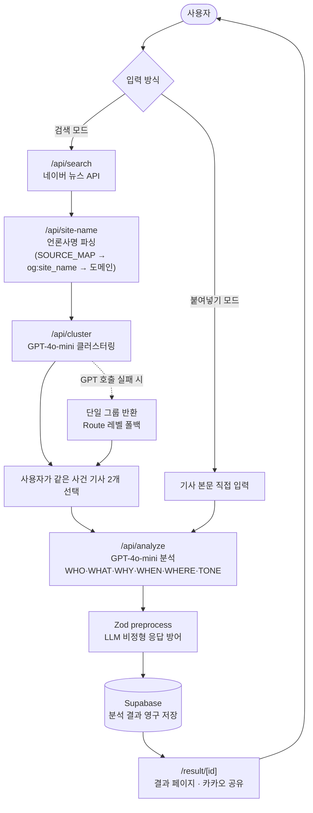

# 본론 (Bon-Ron)

> **"같은 사건, 다른 시각 — 여러 매체의 보도를 30초 안에 구조화해서 나란히 본다"**

**배포**: [bon-ron.vercel.app](https://bon-ron.vercel.app) | **GitHub**: [github.com/tjrmswo/bon-ron](https://github.com/tjrmswo/bon-ron) | **개발 기간**: 2026.04.23 ~ 진행 중 (1인 개발)

---

## 📌 프로젝트 소개

같은 사건을 다루는 여러 언론사의 기사를 비교해보고 싶을 때, 직접 찾아서 읽는 건 너무 번거롭습니다.

**본론**은 검색어 하나로 여러 언론사의 보도 방식을 자동 수집하고, GPT-4o-mini가 WHO / WHAT / WHY / WHEN·WHERE / TONE 항목으로 구조화해 나란히 보여주는 뉴스 분석 서비스입니다.

### 핵심 기능

- **검색 모드** — 네이버 뉴스 API로 기사 수집 → GPT-4o-mini 클러스터링으로 같은 사건별 그룹화 → 2개 선택 → 비교 분석
- **붙여넣기 모드** — 원하는 기사 본문을 직접 붙여넣어 단독 심층 분석
- **결과 공유** — 분석 결과가 고유 URL(`/result/[id]`)로 영구 저장되어 카카오 공유 가능
- **최근 분석 목록** — 메인 페이지에 최근 분석 사례를 노출해 서비스 방향성 제시

---

## 🛠 기술 스택
### Frontend


### Backend


### DevOps


---

## 시스템 아키텍처

### 데이터 플로우



### FSD 레이어 구조

```
src/
├─ app/                     # Next.js App Router (페이지, API Routes)
│   ├─ api/
│   │   ├─ analyze/         # 기사 분석 (GPT-4o-mini)
│   │   ├─ cluster/         # 클러스터링 (GPT-4o-mini)
│   │   ├─ search/          # 뉴스 검색 (네이버 API)
│   │   └─ site-name/       # 언론사명 파싱 (og:site_name)
│   └─ result/[id]/         # 분석 결과 페이지
│
├─ features/
│   └─ article-analyze/     # 핵심 기능 (검색, 분석, 결과 표시)
│       ├─ api/             # 서버 통신 훅
│       ├─ model/           # 비즈니스 로직, 상태 관리
│       ├─ lib/             # 유틸리티 함수
│       └─ ui/              # UI 컴포넌트
│
├─ entities/
│   └─ analysis/            # 분석 도메인 엔티티
│
└─ shared/                  # 공통 컴포넌트, 유틸리티
```

---

## 주요 기술 결정

### 1. GPT-4o-mini 채택 (vs Embeddings, GPT-5.4-nano)

| 모델 | 응답 속도 | 비용/회 | 정확도 | 결과 |
|------|----------|---------|--------|------|
| text-embedding-3-small | 1초대 | ~$0 | 한국어 뉴스 실패 | ❌ |
| GPT-5.4-nano | 2,069ms | $0.000692 | 뒷부분 맥락 오류 | ❌ |
| GPT-4o-mini | 2,991ms | $0.000368 | 정상 | ✅ |

### 2. Zod preprocess로 LLM 응답 방어

프롬프트로 20자 이내를 명시해도 초과하거나, `null`이어야 할 필드에 `"없음"` 같은 문자열을 삽입하는 비정형 응답 문제 → **Zod preprocess**로 스키마 레벨 방어 레이어 구축 → UI 레이아웃 깨짐 방지 및 런타임 오류 사전 차단

### 3. 언론사명 파싱 3단계 Fallback

```
SOURCE_MAP (정적 딕셔너리) → og:site_name 파싱 → 도메인 추출 (tldts)
```

EUC-KR 인코딩 언론사 대응: `arrayBuffer()` + `TextDecoder`


---

## 실행 방법

### 사전 요구사항

- Node.js 18 이상
- pnpm

### 설치

```bash
git clone https://github.com/tjrmswo/bon-ron.git
cd bon-ron
pnpm install
```

### 환경변수 설정

`.env.local` 파일을 생성하고 아래 값을 입력합니다.

```env
# OpenAI
OPENAI_API_KEY=your_openai_api_key

# 네이버 검색 API
NAVER_CLIENT_ID=your_naver_client_id
NAVER_CLIENT_SECRET=your_naver_client_secret

# Supabase
NEXT_PUBLIC_SUPABASE_URL=your_supabase_url
NEXT_PUBLIC_SUPABASE_ANON_KEY=your_supabase_anon_key

# 카카오 (선택)
NEXT_PUBLIC_KAKAO_JS_KEY=your_kakao_js_key
```

### 개발 서버 실행

```bash
pnpm dev
```

[http://localhost:4000](http://localhost:4000) 에서 확인

### 빌드

```bash
pnpm build
pnpm start
```
